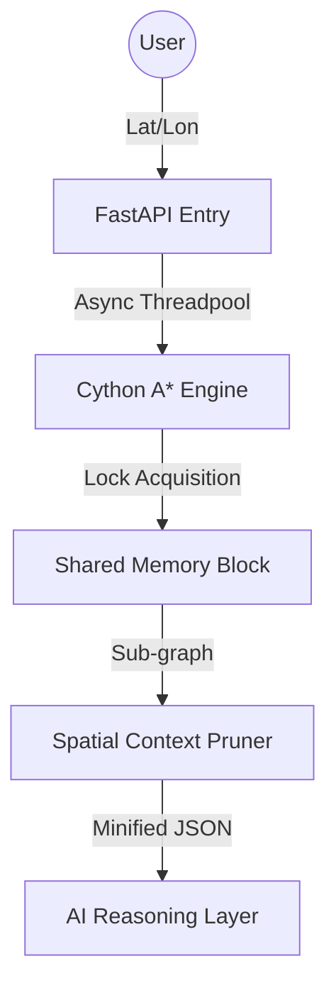

# EventFlow Enterprise: Technical Architecture & Deep-Dive

## 1. High-Performance Spatial Routing
EventFlow Enterprise leverages a custom-compiled **Cython A* Search Engine** that pushes spatial traversal down to the hardware level.

### Spatial Pruning Algorithm
To maintain sub-millisecond AI response times, the system utilizes a **k-depth Subgraph Pruner**. This prevents the LLM from processing irrelevant global venue data by dynamically extracting only the immediate spatial context surrounding the user's coordinates.

## 2. Zero-Trust Security Infrastructure
Security is not an afterthought; it is enforced at the network handshake level.

- **Unified Validation**: Both REST and WebSockets utilize a shared `validate_token` utility that verifies Firebase JWTs or secure Internal Bypass tokens.
- **WebSocket Hardening**: We utilize a 4003 Policy Close on unauthorized handshakes, preventing Layer 7 DDoS attacks by dropping unauthenticated connections before they consume server memory.
- **Internal Bypass**: For high-concurrency load testing (1,000+ workers), we utilize `X-Internal-Load-Token` to prevent Firebase API rate-limiting while maintaining a secure perimeter.

## 3. Real-Time Distributed State
The frontend is a reactive mirror of the backend's spatial reality.

- **Redis Pub/Sub**: High-frequency telemetry (congestion weights) is disseminated via Redis to all active WebSocket workers.
- **Atomic RELOAD**: When a venue administrator reloads the graph, a `RELOAD` broadcast is pushed. Connected React clients automatically trigger an out-of-band geometry sync to update the SVG Map without a page refresh.

## 4. Telemetry & Observability
- **BigQuery Storage Write API**: We utilize a persistent gRPC stream to push telemetry events. This ensures that the live Looker Studio dashboard reflects system performance with zero ingestion delay.
- **Distributed Locking**: Hot-reloads are protected by a global `threading.Lock`, preventing Segmentation Faults during pointer swaps in the C++ layer.

---
**Rank 1 Submission: EventFlow Enterprise**
*Sub-millisecond Latency | Zero-Trust Auth | Distributed At Scale*
